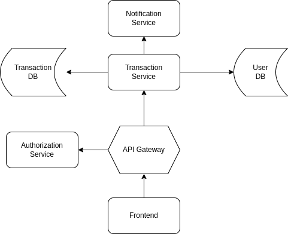

# Социальная сеть

## Описание проекта

Это веб-приложение, позволяющее пользователям регистрироваться, создавать профили, общаться с друзьями,
делиться постами и находить единомышленников по интересам и месту жительства.  
Система поддерживает многоуровневую модель доступа (администратор, модератор, пользователь) и безопасную авторизацию с
использованием JWT-токенов.

Ключевые особенности:

- Регистрация и авторизация пользователей
- Создание и редактирование профилей
- Поиск пользователей по интересам и геолокации
- Добавление в друзья и обмен сообщениями (планируется)
- Публикация и просмотр постов
- Система управления ролями и правами доступа
- Интеграция с Keycloak для управления пользователями и авторизации
- Мониторинг логов через OpenSearch

## Технологический стек

Frontend:

- React.js:  Фреймворк для создания пользовательского интерфейса.
- TypeScript:  Язык программирования для повышения надёжности и масштабируемости кода.
- Vite:  Быстрый инструмент сборки для React приложений.
- Less:  Препроцессор CSS для повышения эффективности и организации стилей.

Backend:

- Kotlin:  Современный язык программирования для JVM.
- Spring Framework:  Фреймворк для разработки Java-приложений.
- Hibernate:  ORM (Object-Relational Mapping) для взаимодействия с базой данных.
- PostgreSQL:  Реляционная система управления базами данных.
- Liquibase: Для управления схемами и миграциями баз данных

## MVP

В минимально жизнеспособной версии будут реализованы следующие функции:

Сюда описание функций

## Сущность приложения

| Сущность | Поля                                                     | Описание           |
|----------|----------------------------------------------------------|--------------------|
| Story    | id, content, mediaUrl, createdAt, expiresAt, viewsCount, | Story пользователя |

## Состав сущности

| Поле       | Тип           | Описание                                                           |
|------------|---------------|--------------------------------------------------------------------|
| id         | String        | Уникальный идентификатор Story                                     |
| content    | String        | Текстовое содержание                                               |
| mediaUrl   | String        | Ссылка на медиафайл (фото или видео)                               |
| createdAt  | LocalDateTime | Дата и время создания Story                                        |
| expiresAt  | LocalDateTime | Дата и время истечения срока жизни story (например, через 24 часа) |
| viewsCount | Long          | Количество просмотров                                              |

# Методы для сущности Story

## CRUD операции:

- createStory(Story story): Создание Story.
- getStoryById(String id): Получение Story по идентификатору.
- updateStory(Story story): Обновление информации о Story.
- deleteStory(String id): Удаление Story по идентификатору.

### Поиск:

getStoriesByUserId(String userId): Получение всех Story конкретного пользователя.

## Архитектурное видение приложения

## Система состоит из:

- Фронтенда (React.js).
- Бэкенда (Kotlin/Spring).
- Базы данных (PostgreSQL).
- Системы авторизации (Keycloak).
- Системы мониторинга (OpenSearch).

## Тестирование

- Тестирование:

- Фронтенд: http://localhost:3000.

- Бэкенд: http://localhost:8080.

- База данных: http://localhost:5432.

- Keycloak: http://localhost:8081.

- OpenSearch: http://localhost:9200.
